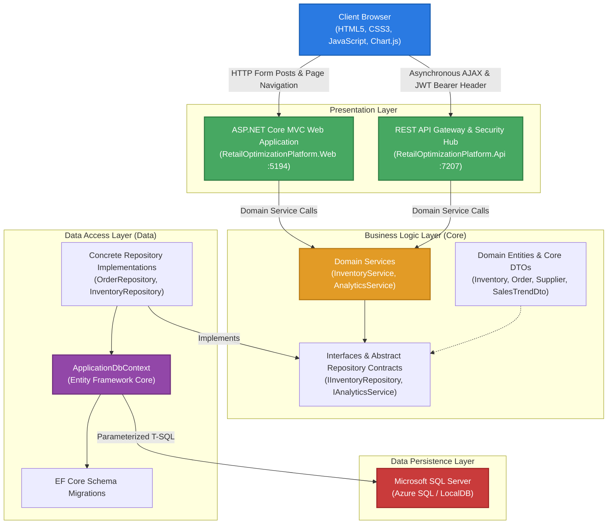
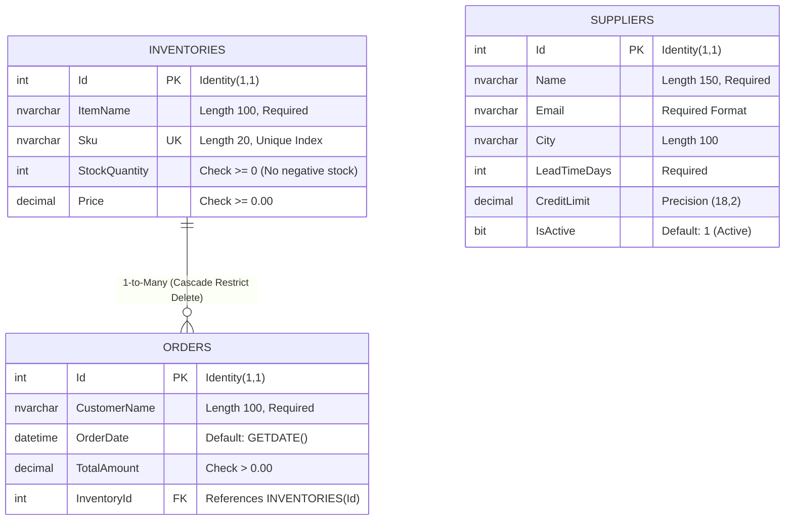
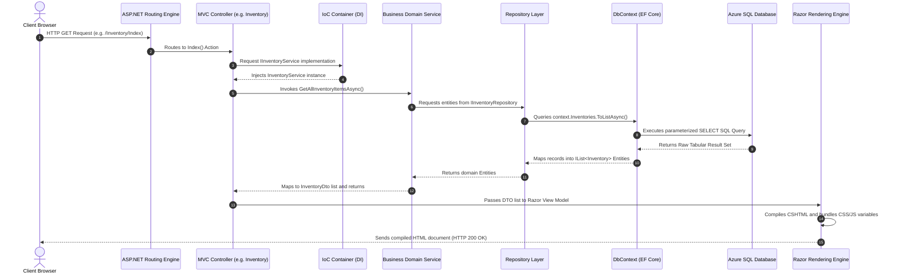
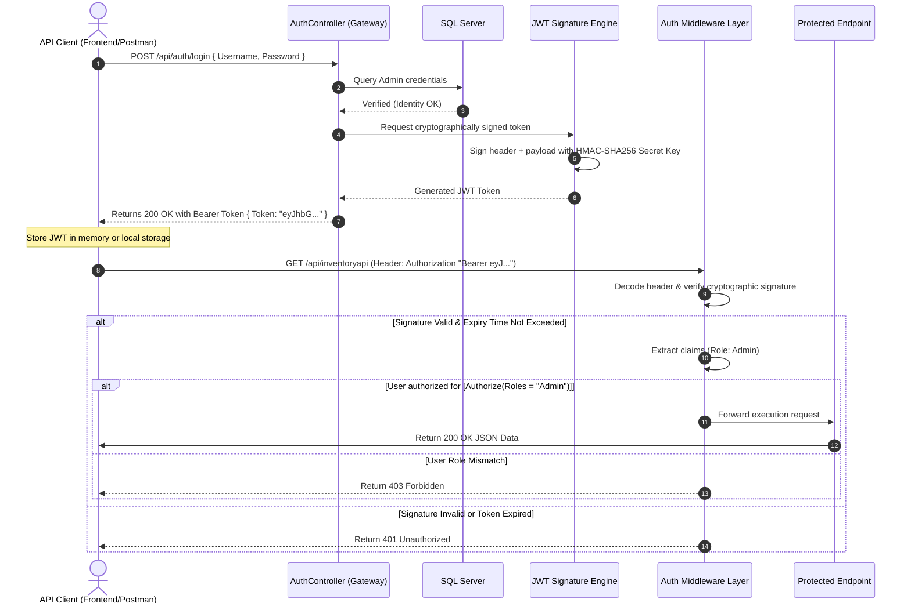
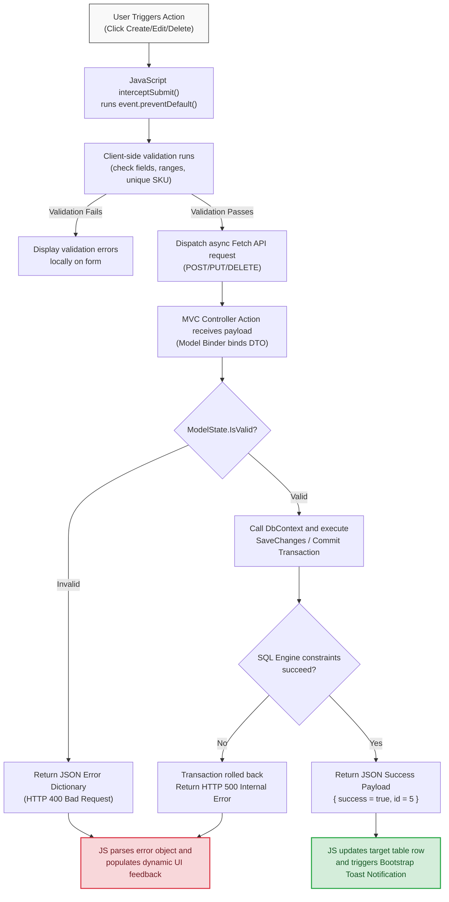
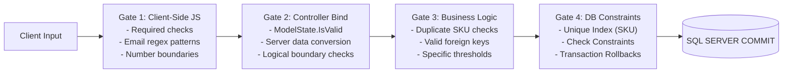

# Enterprise System Architecture & Data Flow Visualizations

This document contains the high-fidelity structural, relational, and data flow visualizations for the **DC-Analytics: Enterprise Retail Optimization Platform**. 

These diagrams render dynamically as high-resolution SVGs when viewed on GitHub.

---

## 1. Decoupled N-Tier Solution Architecture

The application strictly separates concerns across five distinct projects, preventing coupling between the presentation layer and database execution.

---

## 2. Comprehensive Relational Database Schema (ERD)

This Entity-Relationship Diagram maps the structural relationships, keys, unique constraints, and check constraints enforced by the SQL Server engine.

* **Data Safety Note**: Deletions on the `INVENTORIES` table are restricted if associated orders exist. Stock depletions trigger native rollback constraints if values fall below `0`.

---

## 3. Web Request-Response Execution Lifecycle

The sequence below illustrates the lifecycle of a standard HTTP GET request targeting the MVC controller and returning a compiled Razor View.

---

## 4. Stateless JWT Security Authentication Flow

This diagram illustrates the token issuance lifecycle and subsequent verification of role-based authorization headers for protected RESTful endpoints.

---

## 5. CRUD Execution & Asynchronous UI Mutations

To simulate a Single Page Application (SPA) experience within ASP.NET Core MVC, standard form submittals are intercepted by the JavaScript Fetch API to allow real-time DOM updates.

---

## 6. Dependency Injection Resolution Tree

The inversion of control (IoC) container handles object lifecycles. Transient, Scoped, and Singleton scopes isolate database transactions to single HTTP requests.

---

## 7. Comprehensive Data Validation Pipeline

Data flows through multiple validation gates before committing to storage.

