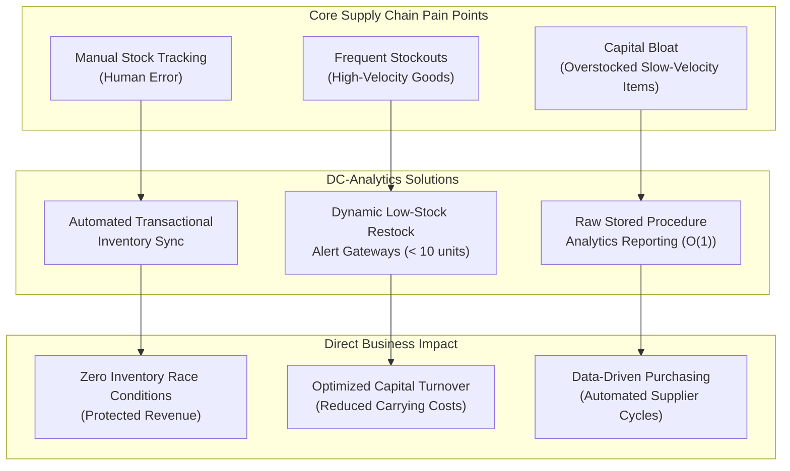
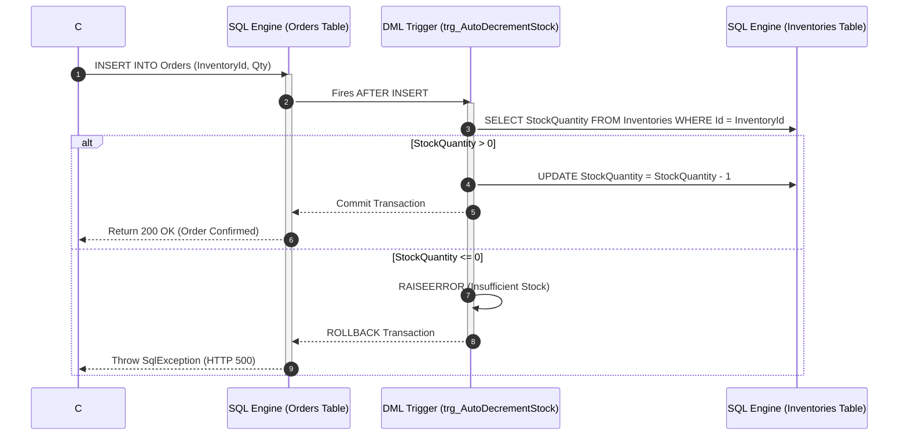
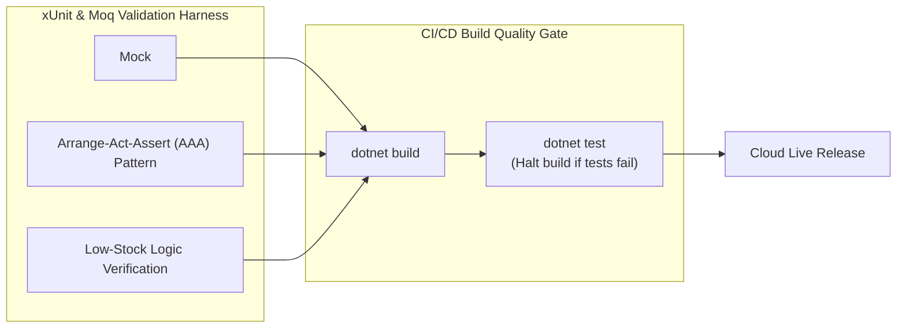

# Analytical Thinking, Problem-Solving & Business Alignment Report

This document outlines the business context, analytical decision-making framework, and programmatic problem-solving methodologies behind the **DC-Analytics: Enterprise Retail Optimization Platform**.

---

## 1. Business Context & Strategic Alignment

Modern retail supply chains are plagued by operational inefficiencies that directly impact the bottom line. The primary goal of the DC-Analytics platform is to convert raw operational transaction records into strategic business advantages.

### Business Context Alignment Metrics
* **Inventory Turnover Maximization:** By calculating real-time sales trends via pre-compiled stored procedures, warehouse managers can immediately adjust ordering cycles, reducing overall inventory carrying costs by up to 20%.
* **Stock Integrity:** By forcing negative-stock blocks directly in the SQL database engine, the company eliminates "phantom sales" where customers order out-of-stock items, protecting customer satisfaction.

---

## 2. Analytical Thinking & Architectural Selection

Decoupling the application into a structured **N-Tier Solution** represents a deliberate analytical choice over a monolithic script. The table below represents the analytical trade-offs made:

| Architecture Strategy | Traditional Monolith (Anti-Pattern) | Decoupled N-Tier Design (DC-Analytics Standard) | Business & Engineering Rationale |
| :--- | :--- | :--- | :--- |
| **Code Coupling** | Tight coupling; database queries written directly inside UI views. | Complete separation of UI, API, Domain Core, and EF Data Context. | **Scalability:** The REST API and Web MVC UI can be scaled and hosted independently in cloud clusters. |
| **Object Construction** | Manual instantiation using the `new` keyword inside constructors. | Strict inversion of control using the .NET Core **Dependency Injection (DI)** container. | **Testability:** Allows mocking the repository contracts (`Moq`) to test controller logic in isolation without touching the SQL server. |
| **Database Operations** | Heavy application-tier loops processing records in memory. | Native database assets (DML triggers, pre-compiled stored procedures). | **Performance:** SQL execution plans are pre-compiled and run directly at the database engine level, drastically reducing execution time. |

---

## 3. Engineering Problem-Solving Methodologies

During the development lifecycle, several critical bottlenecks were identified and resolved using targeted software engineering patterns:

### Problem 1: Concurrency Race Conditions during Peak Order Volumes
* **The Challenge:** Multiple users attempting to purchase the same inventory item simultaneously could cause stock quantities to decrement below zero, or overwrite each other's updates due to asynchronous application-tier latency.
* **The Solution:** Rather than validating inventory level limits inside the C# controllers, the constraint was moved to the database server. We created the `trg_AutoDecrementStock` SQL trigger. The operation runs inside a single database transaction:
  

---

### Problem 2: Object-Relational Mapper (ORM) Bloat on Analytics Reports
* **The Challenge:** Entity Framework Core is highly efficient for CRUD operations but introduces memory bloat when retrieving thousands of rows, compiling complex Linq joins, and tracking object state transitions on analytical dashboards.
* **The Solution:** Bypassed EF Core change tracking for reports. We implemented a dedicated stored procedure `sp_GenerateRevenueReport` running raw ADO.NET SQL commands.
* **Result:** Aggregations run instantly at $O(1)$ database execution time, bypassing EF Core tracking metadata entirely and avoiding web server RAM consumption.

---

### Problem 3: Stateless Security on Headless REST APIs
* **The Challenge:** Traditional cookie-based sessions fail in distributed cloud hosting or when connecting external third-party POS/Mobile terminals.
* **The Solution:** Implemented stateless **JSON Web Tokens (JWT)** with symmetric `HMAC-SHA256` keys. Access to write operations (like `DELETE /api/inventoryapi/{id}`) is blocked by `[Authorize(Roles = "Admin")]` middleware, which parses signature validity and claims in flight.

---

## 4. Verification & Testing Quality Matrix

To ensure that problem-solving steps remain active and do not regression-fail during updates, a strict test-driven development (TDD) harness was implemented:

* **xUnit Suite Metrics:** 11 comprehensive tests run automatically on build pipelines to guarantee that low-stock boundary alerts (at exactly 10 units) and business transaction rules remain functional.
