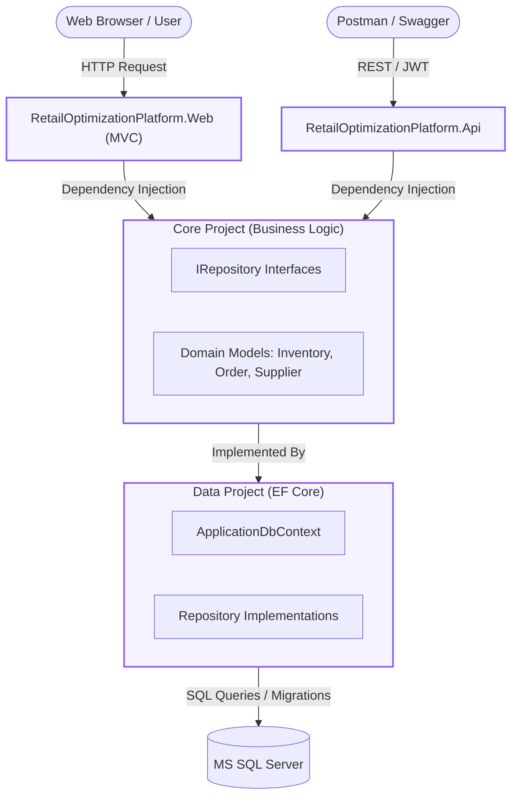
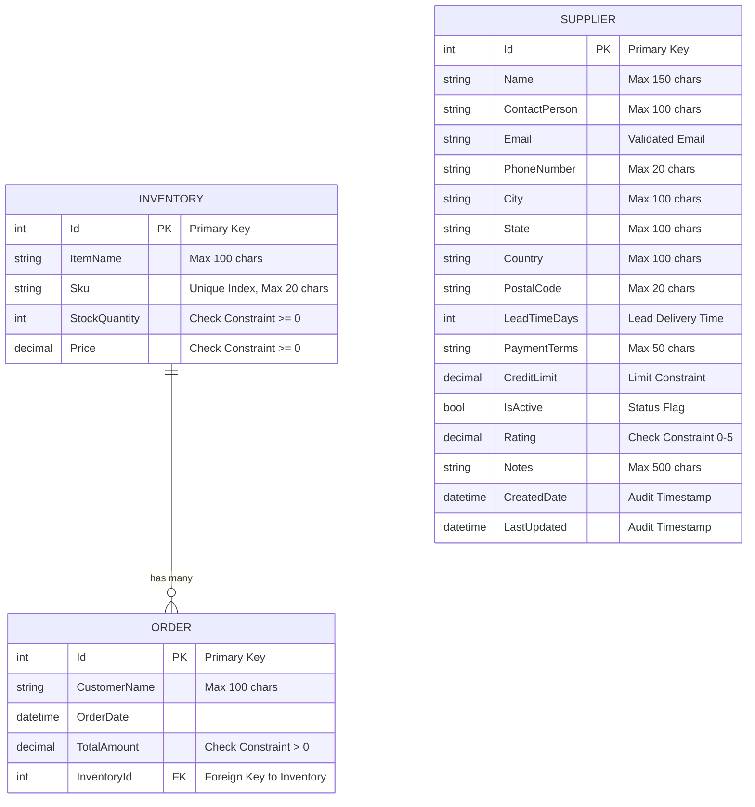

# DC-Analytics: Retail Optimization Platform

<p align="center">
  
  
  
  
  
</p>

<p align="center">
  <b>Wipro NGA Training Program — Capstone Project</b><br />
  Designed and Developed by: <b>Dibyajyoti Chakravarti</b> (GitHub: <a href="https://github.com/DibyaGit">DibyaGit</a>)
</p>

---

## 🌟 Project Overview & Business Context

**DC-Analytics: Retail Optimization Platform** is an enterprise-grade, data-driven web application designed to help retail organizations streamline and optimize their operations. The platform bridges the gap between raw data and business intelligence by providing retail administrators and suppliers with live dashboards, interactive charts, and real-time inventory and order management capabilities.

The project is architected following industry-standard **N-Tier Clean Architecture** principles, enforcing separation of concerns, dependency injection, and strict data validation to deliver a highly maintainable, secure, and extensible codebase.

### 🏆 Key Implementation Highlights

- **Item Eager Loading Bug Fix**: Resolved the common "Item Not Found" UI rendering issues by implementing EF Core eager loading using `.Include(o => o.Inventory)` inside order queries.
- **Pre-Seeded Database Schema**: Built-in automatic database migrations and data seeding for `Inventories`, `Orders`, and `Suppliers` via EF Core's `HasData` API.
- **Advanced SQL & ADO.NET Integrations**: Combines EF Core with raw ADO.NET queries to run optimized stored procedures (`sp_GenerateRevenueReport`) and handles stock validation using database triggers (`trg_AutoDecrementStock`).
- **Premium responsive SaaS UI**: Overhauled the user interface with a custom Indigo/Slate dark-mode theme, glassmorphism card designs, interactive **Chart.js** data visualizations, and full mobile responsiveness with a collapsible sidebar.
- **Model Context Protocol (MCP) API**: Features a custom AI-agent endpoint (`/api/mcpapi/summarize`) that processes store issue tickets and generates structured markdown alerts for LLM-driven analytics.
- **Robust Test Coverage (xUnit + Moq)**: Implements test-driven principles with comprehensive unit testing across repositories, service layers, controllers, and search criteria.

---

## 🛠️ Technical Stack

| Category | Technologies Used |
| :--- | :--- |
| **Backend Framework** | C# 12, .NET 8.0, ASP.NET Core MVC, Web API |
| **Data Access & ORM** | Entity Framework Core 8, ADO.NET (Raw SQL & Stored Procedures) |
| **Database Engine** | Microsoft SQL Server (LocalDB / Express Edition) |
| **Frontend UI** | Razor Views, Vanilla CSS (Premium Custom Theme), jQuery, Bootstrap 5 |
| **Data Visualization** | Chart.js (Dynamic Line, Bar, and Doughnut Charts) |
| **Authentication** | JWT (JSON Web Tokens) with custom claims-based authorization |
| **Testing Suite** | xUnit, Moq, Test-Driven Development (TDD) |
| **DevOps & Cloud** | Docker, Docker Compose, GitHub Actions, Azure Pipelines |

---

## 📐 System Architecture

The project employs a clean layered N-Tier architecture that decouples business logic from presentation and data access layers.



---

## 🗄️ Database Schema & Relationships

The database enforces data integrity through constraints, foreign keys, unique indices, and check constraints to guarantee stable business transactions.



---

## 📂 Project Structure

The project code is organized into distinct logical projects within the Visual Studio Solution:

```
RetailOptimizationPlatform/
├── RetailOptimizationPlatform.Core/       # Domain Entities, Repository Interfaces, Services & Custom Exceptions
├── RetailOptimizationPlatform.Data/       # DbContext, Repository Implementations, Migrations & SQL Scripts
├── RetailOptimizationPlatform.Web/        # MVC Presentation Layer, Razor Views, site.css, Controllers
├── RetailOptimizationPlatform.Api/        # REST Web API, JWT Token Verification & Swagger Integration
└── RetailOptimizationPlatform.Tests/      # xUnit Unit Tests for Services and Controllers using Moq
```

---

## 🚀 Getting Started

Follow these steps to set up, build, and run the project locally.

### 📋 Prerequisites

- **SDK**: [.NET 8.0 SDK](https://dotnet.microsoft.com/download/dotnet/8.0)
- **Database**: [SQL Server LocalDB](https://learn.microsoft.com/sql/database-engine/configure-windows/sql-server-express-localdb) or higher
- **Tools**: EF Core CLI (Install globally via `dotnet tool install --global dotnet-ef`)

### 1. Database Schema Generation & Seeding
Apply EF Core migrations to generate the database schema and populate seed data:
```bash
dotnet ef database update --project RetailOptimizationPlatform.Data --startup-project RetailOptimizationPlatform.Web
```

### 2. Register Stored Procedures & Triggers
Execute the custom database setup script. This registers the `trg_AutoDecrementStock` trigger and the `sp_GenerateRevenueReport` stored procedure:
```bash
sqlcmd -S "(localdb)\mssqllocaldb" -i "RetailOptimizationPlatform.Data\Scripts\DatabaseSetup.sql"
```

### 3. Run the MVC Web Dashboard
```bash
dotnet run --project RetailOptimizationPlatform.Web
```
The application will launch. Open your browser and navigate to the local URL (usually `http://localhost:5000` or `https://localhost:5001`).

### 4. Run the REST API & Access Swagger
```bash
dotnet run --project RetailOptimizationPlatform.Api
```
Navigate to `http://localhost:5002/swagger` (or the terminal-assigned port) to access the interactive API docs.

### 5. Running the Test Suite
Run the test runner to execute the TDD test suite:
```bash
dotnet test
```

---

## 🐳 Containerization & Deployment

To run the complete platform (Web App, Web API, and SQL Server) in Docker:
```bash
docker-compose up --build
```
This starts all services and connects them via a secure Docker network.

---

## 🤖 AI & Copilot Usage Log

This project leveraged Generative AI to accelerate development, design the database schema constraints, and write comprehensive unit tests:

1. **Database Schema & Constraints**:
   - *Prompt*: *"Generate an Entity Framework Core OnModelCreating method that enforces a unique index on the Sku column, adds check constraints to prevent negative stock quantities, and inserts 4 initial seed data records for an Inventory entity."*
2. **Middleware & Exception Handling**:
   - *Prompt*: *"Write a GlobalExceptionMiddleware class for ASP.NET Core 8 that catches a custom InventoryNotFoundException and returns a 404, while catching all other fatal exceptions and returning a generic 500 error to hide stack traces."*
3. **API Response Standardization**:
   - *Prompt*: *"Refactor this ASP.NET Core REST API controller to ensure every HTTP response returns a standardized JSON object containing 'Error' and 'Message' properties when ModelState is invalid or an item is not found."*
4. **TDD Unit Testing**:
   - *Prompt*: *"Create an xUnit test class using the Moq framework. Write an Arrange-Act-Assert test that verifies an InventoryApiController returns a NotFoundObjectResult when the mocked IInventoryRepository returns a null item."*

---

## 📄 Project Documentation & Reports

- 📘 **Official Capstone Project Report**: [Dibyajyoti_Chakravarti_Capstone_Report.pdf](./Dibyajyoti_Chakravarti_Capstone_Report.pdf) — Comprehensive report covering project scope, system architecture, database design, test specifications, and training program outcomes.

---

## 👤 Author Information

- **Name**: Dibyajyoti Chakravarti
- **GitHub**: [@DibyaGit](https://github.com/DibyaGit)
- **Program**: Wipro NGA Training (Capstone Project)
- **Role**: Full-Stack .NET Developer